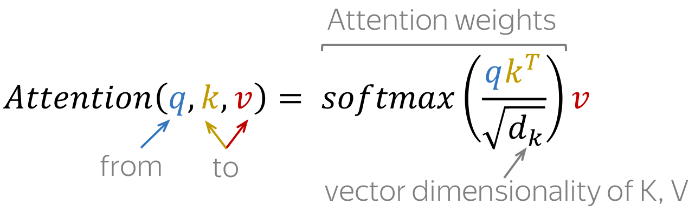

# Attention Is All You Need ?

## Sequence to Sequence (seq2seq)

Formally, in the machine translation task, we have an input sequence and an output sequence (note that their lengths can be different). Translation can be thought of as finding the target sequence that is the most probable given the input; formally, the target sequence that maximizes the conditional probability 

### Encoder-Decoder Framework

Encoder-decoder is the standard modeling paradigm for sequence-to-sequence tasks.

- <b>encoder</b> - reads source sequence and produces its representation
- <b>decoder</b> - uses source representation from the encoder to generate the target sequence.

In particular, the high-level pipeline is as follows:

- feed source and previously generated target words into a network;
- get vector representation of context (both source and previous target) from the networks decoder;
- from this vector representation, predict a probability distribution for the next token.

## Attention 

#### Problem: 
Fixed source representation is suboptimal:
(i) for the encoder, it is hard to compress the sentence; 
(ii) for the decoder, different information may be relevant at different steps.

Solution : <b>Attention ??</b>

introduced in the paper [Neural Machine Translation by Jointly Learning to Align and Translate](https://arxiv.org/pdf/1409.0473)

    Complete side note 
    A implementation of the paper by me can be found [here](https://github.com/samyxandz/NMT-English-To-Portugeese)

The main idea that a network can learn which input parts are more important at each step. 

## Transformer: Attention is All You Need

Transformer is a model introduced in the paper [Attention is All You Need](https://arxiv.org/pdf/1706.03762) in 2017. It is based solely on attention mechanisms

### Working

- Transformer's encoder can be thought of as a sequence of reasoning steps (layers). At each step, tokens look at each other (this is where we need attention - self-attention), exchange information and try to understand each other better in the context of the whole sentence.

- In each decoder layer, tokens of the prefix also interact with each other via a self-attention mechanism, but additionally, they look at the encoder states

#### Self-Attention
Looking at each other 

Self Attention is looking from a set of sets to all the other states in the same set.
Self-attention is the part of the model where tokens interact with each other. Each token "looks" at other tokens in the sentence with an attention mechanism, gathers context, and updates the previous representation of "self".
Tokens try to understand themselves in context to themselves.

##### Query, Key, and Value in Self-Attention

Each input token in self-attention receives three representations corresponding to the roles it can play:

- query - asking for information;
- key - saying that it has some information;
- value - giving the information.

The query is used when a token looks at others - it's seeking the information to understand itself better. The key is responding to a query's request: it is used to compute attention weights. The value is used to compute attention output

#### Masked Self-Attention

decoder is a self-regressor and can't see the future words

encoder in transformer is a self-regressor,which means it will predict the next token according to the previous,so input x can't see the future words;
we use masked multi-head attention to do this.
Basically some token in the input sequence are omitted from contributing to attention weigths

#### Multi-Head Attention

Instead of having one attention mechanism, multi-head attention has several "heads" which work independently.
good stuff on attention heads :
https://lena-voita.github.io/posts/acl19_heads.html 

    References:
    - https://lena-voita.github.io/nlp_course.html
    - https://arxiv.org/pdf/1706.03762
    - https://www.youtube.com/watch?v=zxQyTK8quyY
    - https://www.youtube.com/watch?v=iDulhoQ2pro 
    - https://www.youtube.com/watch?v=kCc8FmEb1nY
